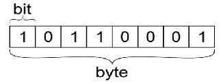
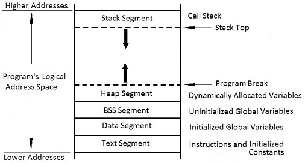
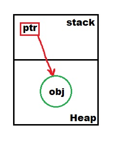

- [Memory Management](#memory-management)
  - [Unit of a data](#unit-of-a-data)
  - [බිට් (bit)](#බිට්-bit)
  - [බයිට් (byte)](#බයිට්-byte)
  - [Computer Memory](#computer-memory)
- [Computer Memory Layout](#computer-memory-layout)
  - [Stack](#stack)
  - [Heap](#heap)
  - [BSS (Block Started by Symbol)](#bss-block-started-by-symbol)
  - [Data](#data)
  - [Text (also known as Code)](#text-also-known-as-code)
- [Variables](#variables)
  - [Data Types](#data-types)
    - [Integer Types](#integer-types)
    - [Floating-Point Types](#floating-point-types)
    - [Other Numeric Types](#other-numeric-types)
    - [Compound Types](#compound-types)
    - [Derived Types](#derived-types)
    - [Pointers and References](#pointers-and-references)
    - [Special Types](#special-types)


# Memory Management

## Unit of a data
## බිට් (bit)
1 හෝ 0

## බයිට් (byte)
bit 8 ක් byte එකක් ලෙස හදුන්වයි.



## Computer Memory
- **Memory එකක `bit` access කල නොහැක.** බොහෝ විට access කල හැක්කේ `1 byte` ක් ප්‍රමාණයේ කොටස් පමණි. මීට හේතුව Memory එකේ පවතින සෑම bit එකකටම address එකක් ලබා දුන්නේ නම් ඉතා විශාල address ප්‍රමාණයක් අවශ්‍ය වේ.
- Memory එකේ සිට Processor එකට වරකට යවන දත්ත ප්‍රමාණය `instruction size` එක ලෙස හදුන්වයි.
  - 32bit oparating system එකක instruction size එක 4 byte වේ.
  - 64bit oparating system එකක instruction size එක 8 byte වේ.

# Computer Memory Layout
  


## Stack
Statk එක යනු `local variables` සහ `fuction call informations` store කරන memory region එකකි. Functions call වීමේදී හා return වීමේදී මෙහි ප්‍රමාණය ඊට ගැලපෙන ලෙස වෙනස් වේ. සාමාන්‍යයෙන් Program එකක සෑම thread එකකට එයටම අයිති වූ stack එකක් පවතී. යම් fuction එකක් call වන විට එහි ඇති local varibles stack එකට load වන අතර එම function එක return වීමේදී load වූ local variables ඉවත් වීම සිදුවේ. මෙහිදී අවසානයට load වූ දත්ත පළමුව ඉවත් වීම සිදුවිය යුතුය. (පිගන් අට්ටියක් මෙන්)

Statck එකට යවන සෑම local variable එකකම වර්ගය සහ ප්‍රමානය compile time එකේදී දැනගෙන සිටීම අත්‍යවශ්‍ය වේ. උදාරණයක් ලෙස stack එක තුල array එකක් සාදනවානම් එහි length එක compile time එකේදී දැනගෙන සිටීම අත්‍යවශ්‍ය වේ. මෙලෙස compile time එකේදී local variable එකක ප්‍රමාණය අවිනිශ්චිත නම් එම variable එක සෑදිය යුත්තේ Heap එක තුලයි.

## Heap
Heap එක භාවිතා කරන්නේ dynamic memory allocation සදහායි. එනම් compile time එකේදී local variable එකක ප්‍රමාණය අවිනිශ්චිත නම් එවැනි variable Heap එක තුල සාදනු ලබයි.

C සහ C++ වලදී `malloc() function` එක මගින් හා `new keyword` එක මගින් මෙලෙස heap එක තුල memory allocation සිදුකර ගත හැක.
- `malloc()` function එක මගින් memory allocat කිරීම සිදුකල හොත් `free()` function එක මගින් memory deallocat කිරීම සිදුකල යුතුය.
- `new` keyword එක මගින් memory allocat කිරීම සිදුකල හොත් `delete` keyword එක මගින් memory deallocat කිරීම සිදුකල යුතුය.

C සහ C++ වලදී Heap එක compiler එක මගින් හෝ language runtime එක මගින් ස්වයංක්‍රීයව manage කිරීමක් සිදු නොවේ. මේ නිසා C සහ C++ වලදී Heap එක තුල නිවැරදි ලෙස memory allocate කිරීම සහ deallocate කිරීම programmer සතු වගකීමකි.

Heap එකේ යම් object එකක් සෑදූ විය එය access කිරීම සදහා stack එක තුල `pointer variable` එකක් සාදාගනු ලබයි. 



Pointer variable එක මගින් memory address location එක මතකතබා ගනී.
```cpp
struc
int main(){
    
}
```

## BSS (Block Started by Symbol)
`Uninitialized global and static variables` ගබඩා කිරීම සදහා BSS segment එක භාවිතා කරයි. Programm එකක් start කිරීමේදී මෙම variable සදහා zero හෝ null ලබා දෙනු ලබයි.

*මෙහි x යනු uninitialized global variable එකකි.*
```c
int x;

int main(){
    return 0;
}
```

## Data
`Initialized global and static variables` ගබඩා කිරීම සදහා data segment එක භාවිතා කරයි.

*මෙහි x යනු initialized global variable එකකි.*
```c
int x = 10;

int main(){
    return 0;
}
```

## Text (also known as Code)
මෙය Code segment එක ලෙසද හදුන්වයි. මෙය read-only section එකක් වන අතර program එකක් compile කරල පසු සෑදෙන machine instructions prgram එක run වන අවස්ථාවේදී ගබඩා කිරීම සදහා මෙය භාවිතා වේ.

# Variables

Computer memory එකේ යම් කිසි value එකක් store කරලා තියාගන්න ඉඩක් variable එකක් ලෙස හදුන්වයි.

## Data Types
In both C and C++, there are several data types available to represent different kinds of values. The data types in C and C++ include:

### Integer Types
   - `int`: Integer type, typically 4 bytes in size.
   - `char`: Character type, typically 1 byte in size.
   - `short`: Short integer type, typically 2 bytes in size.
   - `long`: Long integer type, typically 4 or 8 bytes in size.
   - `long long`: Long long integer type, typically 8 bytes in size (introduced in C99 and C++11).
   - `unsigned`: Unsigned integer type, which can only represent positive or zero values.
   - `signed`: Signed integer type, which can represent both positive and negative values (default for `int`).

### Floating-Point Types
   - `float`: Single-precision floating-point type, typically 4 bytes in size.
   - `double`: Double-precision floating-point type, typically 8 bytes in size.
   - `long double`: Extended-precision floating-point type, size varies.

### Other Numeric Types
   - `bool`: Boolean type that can hold either `true` or `false` values.
   - `enum`: User-defined enumeration type, which defines a set of named values.

### Compound Types
   - `struct`: User-defined composite type, which groups multiple variables together.
   - `union`: User-defined composite type, similar to `struct`, but all members share the same memory location.
   - `class` (in C++): User-defined composite type, similar to `struct`, but with additional features like member functions and access specifiers.
   - `enum class` (in C++): Scoped enumeration type introduced in C++11, where enumerators are part of a named scope.

### Derived Types
   - `typedef`: Used to create an alias for an existing type.
   - `const`: Qualifier used to define constants.
   - `volatile` (in C and C++): Qualifier used to indicate that a variable's value may change unexpectedly.
   - `auto` (in C++): Deduced type specifier, automatically infers the type based on the initializer.

### Pointers and References
   - Pointers (`*`): Variables that store memory addresses.
   - References (`&` in C++, not available in C): Aliases for existing variables.

### Special Types
   - `void`: Represents the absence of a type. Used as a return type or to indicate an empty parameter list.
   - `wchar_t` (in C and C++): Wide character type, typically 2 or 4 bytes in size, used for extended character sets.

These data types provide the foundation for representing and manipulating different kinds of values in both C and C++.


