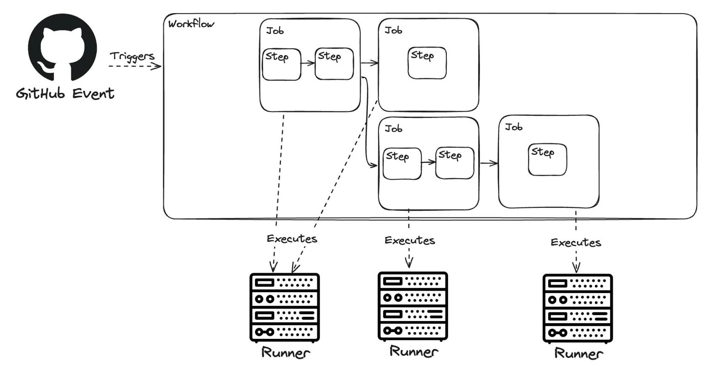
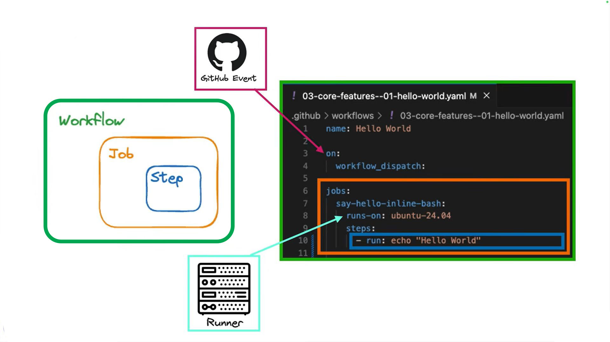
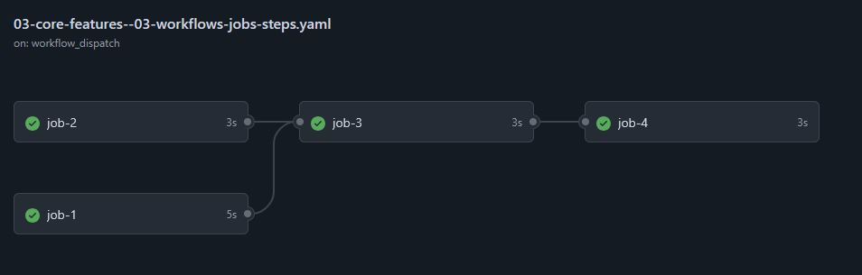

# GitHub Actions

- [GitHub Actions](#github-actions)
  - [Workflows](#workflows)
    - [Name](#name)
    - [On](#on)
    - [Jobs](#jobs)
      - [Run On](#run-on)
      - [Steps](#steps)
      - [Needs](#needs)
  - [Environment Variables](#environment-variables)
  - [Secrets and Variables](#secrets-and-variables)


GitHub Actions යනු GitHub හි ඇතුළතම Continuous Integration (CI) සහ Continuous Deployment (CD) සේවාවකි. GitHub Actions මඟින් ඔබට ඔබේ කේතය සෑදීම, පරීක්ෂා කිරීම සහ නිකුත් කිරීම ස්වයංක්‍රීය කිරීමට හැකියාව ලැබේ.

[Course Repo link](https://github.com/y-developer/devops-directive-github-actions-course.git)

## Workflows



workflow එකක ප්‍රධාන කොටස් 3 ක් ඇත.
- `Name`: workflow එකේ නම
- `On`: workflow එක ක්‍රියාත්මක වීමට හේතු
- `Jobs`: workflow එකේ ක්‍රියාකාරකම්



### Name
workflow එකේ නම `name` keyword එක මඟින් සඳහන් කරයි. නමක් නොදැක්වුවහොත්, default ලෙස workflow file එකේ නම භාවිතා කරනු ලැබේ.

### On
`on` keyword එක මඟින් workflow එක ක්‍රියාත්මක වීමට හේතු සඳහන් කරයි. workflow එකක් විවිධ event මත ක්‍රියාත්මක කළ හැකිය. උදාහරණයක් ලෙස, `push`, `pull_request`, `schedule`, `workflow_dispatch` වැනි event මත workflow එක ක්‍රියාත්මක කළ හැකිය. [තවදුරටත් බලන්න](./github_actions_events.md)

### Jobs
workflow එකක් තුළ එක හෝ වැඩි job තිබිය හැක. job එකක් යනු workflow එකේ ක්‍රියාකාරකමක් වන අතර එය run වන්නේ isolated environment එකක (Ubuntu, Windows, MacOS) යටතේය.

#### Run On
`runs-on` keyword එක මඟින් job එක run වීමට අවශ්‍ය operating system එක සඳහන් කරයි. උදාහරණයක් ලෙස `ubuntu-latest`, `windows-latest`, `macos-latest` වැනි operating system එකක් සඳහන් කළ හැක.

#### Steps
job එකක් තුළ එක හෝ වැඩි steps තිබිය හැක. step එකක් යනු job එකේ ක්‍රියාකාරකමක් වන අතර එය run වන්නේ job එකේ defined compute environment එක තුළය.

steps වර්ග දෙකක් පවතී. 
1. `uses`: GitHub Action එකක් භාවිතා කිරීම
2. `run`: command එකක් run කිරීම. 

```yaml
jobs:
  <job_id>:
    runs-on: <run වෙන්නේ කොහොද? ubuntu, windows, macos>
    steps:

        # action steps examples
      - name: <step name>
        uses: <action එකක් භාවිතා කරනවා නම් එහි නම>
        with:
          <parameter_name>: <parameter_value>

        # run step example
      - name: <step name>
        run: <command එකක් භාවිතා කරනවා නම් එය>
        shell: <command එක run කිරීමට භාවිතා කරන shell එක (default: bash) (ex: python, bash, sh, pwsh, cmd)>
```

#### Needs

එක job එක්ක තවත් job එකක් depend වෙන්න ඕන නම් `needs` keyword එක භාවිතා කරන්න පුළුවන්. 

```yaml
name: Workflows, Jobs, and Steps

on:
  workflow_dispatch:
jobs:
  job-1:
    runs-on: ubuntu-24.04
    steps:
      - run: echo "A job consists of"
      - run: echo "one or more steps"
      - run: echo "which run sequentially"
      - run: echo "within the same compute environment"
  job-2:
    runs-on: ubuntu-24.04
    steps:
      - run: echo "Multiple jobs can run in parallel"
  job-3:
    runs-on: ubuntu-24.04
    needs:
      - job-1 # This job depends on job-1
      - job-2 # Also this job depends on job-2
    steps:
      - run: echo "They can also depend on one another..."
  job-4:
    runs-on: ubuntu-24.04
    needs:
      - job-2 # This job depends on job-2
      - job-3 # Also this job depends on job-3
    steps:
      - run: echo "...to form a directed acyclic graph (DAG)"
```




## Environment Variables
GitHub Actions workflow එකක් තුළ environment variables භාවිතා කළ හැක. Environment variables මඟින් workflow එකේ steps අතර දත්ත හුවමාරු කිරීම පහසු වේ. Environment variables define කිරීම සඳහා `env` keyword එක භාවිතා කරයි. [තවදුරටත් බලන්න](./github_actions_env_variables.md)

## Secrets and Variables
GitHub Actions workflow එකක් තුළ sensitive data (e.g., API keys, passwords) සහ non-sensitive configuration data (e.g., deployment environments, feature flags) භාවිතා කිරීමට Secrets සහ Variables භාවිතා කළ හැක. 

මෙය ් `https://github.com/organization/<your-organization>/settings/secrets/actions` හෝ 

Settings > Secrets and variables > Actions යන මාර්ගයෙන් කළ හැක. Secrets සහ Variables workflow එකේ steps අතර environment variables ලෙස භාවිතා කළ හැක. Secrets සහ Variables define කිරීම සඳහා `secrets` සහ `vars` keywords භාවිතා කරයි.

```yaml
jobs:
  example-job:
    runs-on: ubuntu-latest
    steps:
      - name: Use Secrets and Variables
        run: |
          echo "Secret Value: ${{ secrets.MY_SECRET }}"
          echo "Variable Value: ${{ vars.MY_VARIABLE }}"
```
