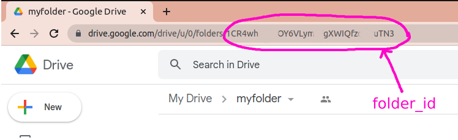

<p align="center">
  
  
</p>

# Using with service account

1. [Create Google Cloud project](../create-google-cloud-project.md)
1. [Enable Google Dirve API for your project](../enabled-apis-and-services.md)
1. [Generate Keys for Server to Server Auth](../enabled-apis-and-services.md)

1. Goto google drive and make folder
1. Share newly created folder with service account email


## Upload file

Get `folder id` of newly created folder



Link generated keys as `./credentials.json`  in 3ed step

```python
from google.oauth2 import service_account
from googleapiclient.discovery import build
from googleapiclient.http import MediaFileUpload
from googleapiclient.errors import HttpError


SCOPES = ['https://www.googleapis.com/auth/drive']
SERVICE_ACCOUNT_FILE = './credentials.json'

def main():
    # create credentials with secrets file
    credentials = service_account.Credentials.from_service_account_file(
        SERVICE_ACCOUNT_FILE, scopes=SCOPES)

    try:
        # create drive api client
        service = build('drive', 'v3', credentials=credentials)

        folder_id = '*******************************'
        file_metadata = {'name': 'pic.jpg', 'parents': [folder_id]}
        media = MediaFileUpload('pic.jpg', mimetype='image/jpeg')
        
        # pylint: disable=maybe-no-member
        file = service.files().create(body=file_metadata, media_body=media, fields='id').execute()
        print(F'File ID: {file.get("id")}')

    except HttpError as error:
        print(F'An error occurred: {error}')
        file = None

    return file.get('id')


if __name__ == '__main__':
    main()
```