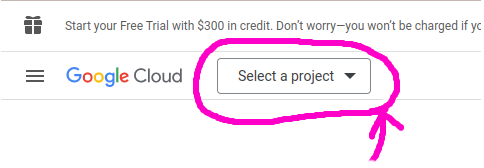
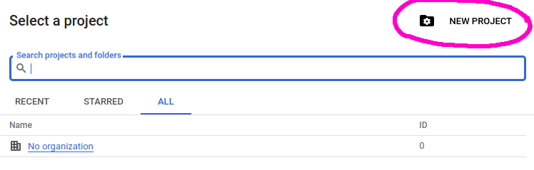
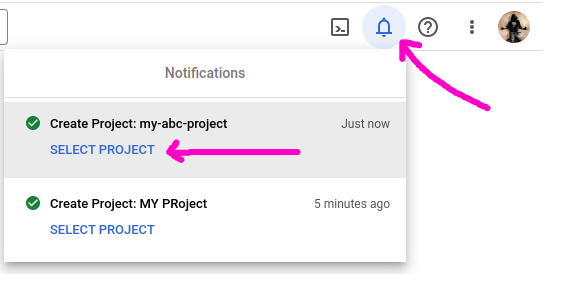

# Create a Google Console Project

Go to [Google Cloud Console](https://console.cloud.google.com/)

Click `Select a project`

Click `NEW PROJECT`

Add `Project name` and click Click `CREATE` Button

Click Notification Icon and click `SELECT PROJECT`

