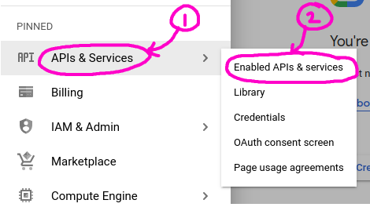
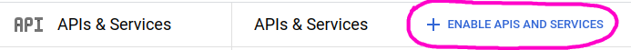
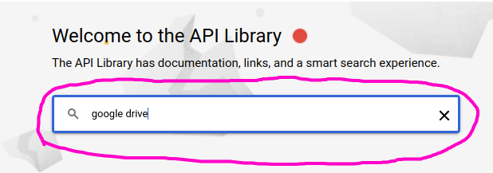
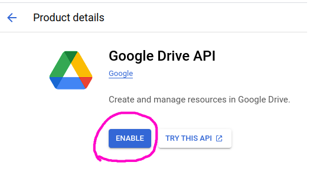

# Enabled APIs & services

Go to project selection area and select your project

Click menu icon

Click `APIs & Sevices` > `Enabled APIs and services`

Click `+ ENABLE APIS AND SERVICES`

Search and find api you want

Enable API

