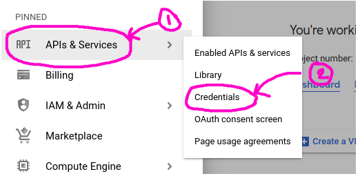
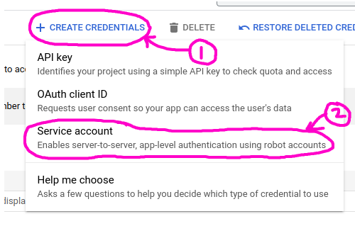
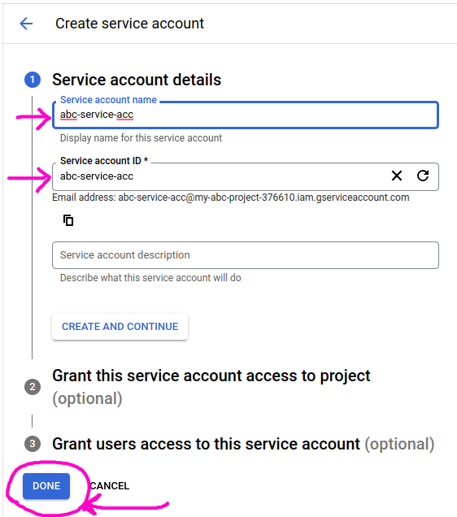
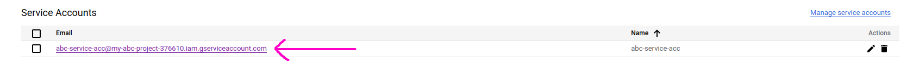
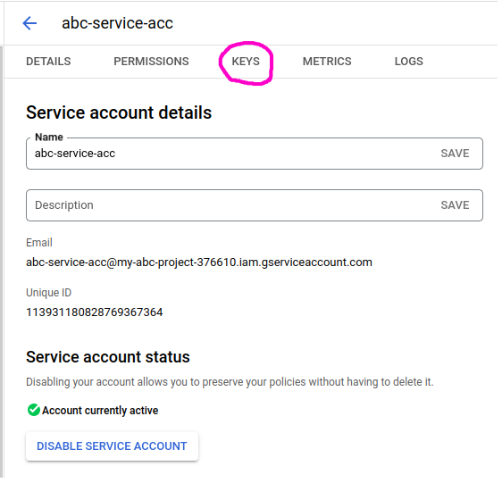
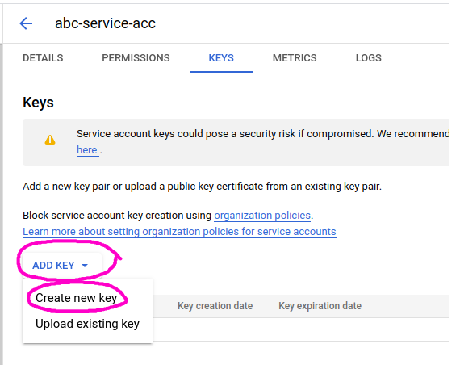
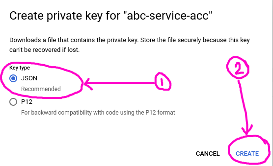

# Create Server to Server Authentication

## Create Service Account

Go to project selection area and select your project

Click menu icon

Click `APIs & Sevices` > `Credentials`

Click `+ CREATE CREDENTIALS` > `Service account`

Give `Service account name` and `Service account ID` after click `DONE`

## Generate Auth keys

Go to `Service Accounts` section of `APIs & Sevices` > `Credentials` page and click on `Service Account email`

Goto `keys` section

Click `ADD KEY` > `Create new key`

Select `JSON` option and `CREATE` button

The keys will Download in your pc