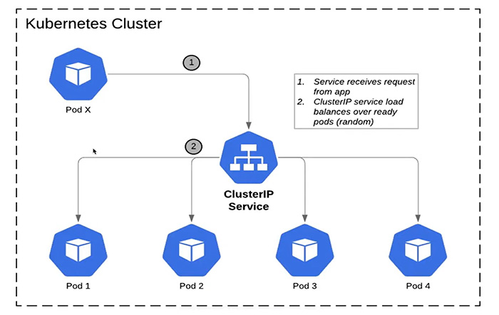

# Kubernetes Service

<p align="center">
  
</p>

Kubernetes Services යනු pods වලට access කිරීම සදහා ඒවායේ real IP එක වෙනුවට භාවිතා කරන abstraction layer එකකි. මෙය website එකක් access කිරීමට එහි IP එක වෙනුවට Domain එක භාවිතා කිරීමට සමාන ක්‍රියාවලියකි. pod ගණන scale up හා scale down වීමේදී ඒවා සමග ඒවායේ real IP ද වෙනස් වීමට සිදුවේ. මේ නිසා pods වල commination සිදු කිරීමට real IP එක වෙනුවට Kubernetes Service භාවිතය අත්‍යවශ්‍ය වේ.

පහත දැක්වෙන්නේ එසේ භාවිතා කල හැකි service types.

|Service Type|Description|
|-|-|
|Cluster IP|sets up an easy-to-remember URL to access a pod. only exposes pods in the cluster|
|Node Port|Make a pod accessible from outside the cluster. Usually only used fro dev purposes|
|Load Balancer|Makes a pod accessible from outside the cluster. this is the right way to expoes a pod to the outside world|
|External Name|Redirects an in-cluster request to a CNAME url|



## Service Types

### Cluster IP

### Node Port
```yaml

```

### Load Balancer