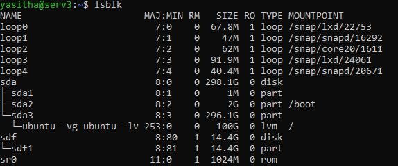
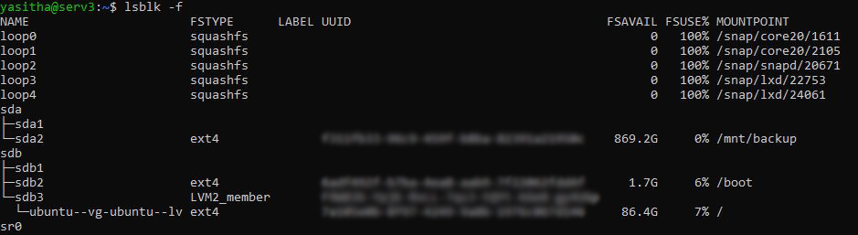

# Disk Management

- [Disk Management](#disk-management)
  - [PC එකට සම්බන්ධ කර ඇති disk මොනවාදැයි බැලීමට](#pc-එකට-සම්බන්ධ-කර-ඇති-disk-මොනවාදැයි-බැලීමට)
  - [Disk එකක් තාවකාලිකව mount කිරීම](#disk-එකක්-තාවකාලිකව-mount-කිරීම)
  - [Disk එකක් ස්ථීරව mount කිරීම](#disk-එකක්-ස්ථීරව-mount-කිරීම)
  - [ssh හරහා remote disk එක්ක mount කිරීම](#ssh-හරහා-remote-disk-එක්ක-mount-කිරීම)
  - [Disk එකක් unmount කිරීම](#disk-එකක්-unmount-කිරීම)
  - [Disk එකක් Format කිරීම](#disk-එකක්-format-කිරීම)


## PC එකට සම්බන්ධ කර ඇති disk මොනවාදැයි බැලීමට
```bash
lsblk
```
එවිව පහත ආකාරයට result එකක් බලාගත හැක.



මෙහි `sda` යනු disk එකක් වන අතර\
`sda1`, `sda2`, `sda3` යනු `sda` disk එකේ partition වේ.

මෙහි `sdf` යනු disk එකක් වන අතර\
`sdf1` යනු `sdf` disk එකේ partition වේ.

මෙම `sda`, `sda1`, `sda2`, `sda3`, `sdf`, `sdf1` යන ඒවා පවතින්නේ  `/dev/` folder එක තුල file ලෙසිනි. `/dev/` එක තුල ඇත්තේ system එකේ devices වල නිරූපණයන් වේ.

පහත command මගින් එහි වැඩි විස්තර බලාගත හැක.
```bash
lsblk -f
```



## Disk එකක් තාවකාලිකව mount කිරීම

සාමාන්‍යයෙන් තාවකාලිකව mount කරන්නේ USB Flash drive ආදියයි.\
පළමුව disk එක mount කිරීමට ස්ථානයක් තෝරාගත යුතුය. මේ සදහා ඹ්නෑම ස්ථානයක් තෝරාගත හැකි වුවද, තාවකාලික mount කිරීමක් සදහා බොහෝවිට භාවිතා කල යුතු වන්නේ `/media/` folder එකයි.

උදාහරණයක් ලෙස `/media/` folder එකට `disk1` යනුවෙන් `sdf1` partition mount කිරීම සලකා බලමු.

පළමුව media folder එක තුල `disk1` යනුවෙන් folder එකක් සාදාගත යුතුය.
```bash
sudo mkdir /media/disk1
```

දැන් mount කිරීම සිදුකල යුතුය.
```bash
sudo mount /dev/sdf1 /media/disk1/
```

## Disk එකක් ස්ථීරව mount කිරීම
සාමාන්‍යයෙන් ස්ථීරව mount කරනු ලබන්නේ sata මගින් සම්බන්ධ කර ඇති hard drive වේ.\
පළමුව disk එක mount කිරීමට ස්ථානයක් තෝරාගත යුතුය. මේ සදහා ඹ්නෑම ස්ථානයක් තෝරාගත හැකි වුවද, ස්ථීර mount කිරීමක් සදහා බොහෝවිට භාවිතා කල යුතු වන්නේ `/mnt/` folder එකයි.

උදාහරණයක් ලෙස `/mnt/` folder එකට `disk1` යනුවෙන් `sdf1` partition mount කිරීම සලකා බලමු.

පළමුව mnt folder එක තුල `disk1` යනුවෙන් folder එකක් සාදාගත යුතුය.
```bash
sudo mkdir /mnt/disk1
```

දැන් `/etc/fstab` file එක edit කල යුතුය. ඒ සදහා `/etc/fstab` file එක nano editor එකෙන් open කරගන්න.
```bash
sudo nano /etc/fstab
```

දැන් එයට පහත සදහන් line එක add කර save කරන්න
```txt
/dev/disk/by-uuid/<uuid_එක> /mnt/disk1 <type_එක> defaults 0 2
```
uuid එක හා file type එක දැන ගැනීමට `lsblk -f` භාවිතා කරන්න.

දැන් mount කිරීම සිදුකරන්න.
```bash
sudo mount -a
```

දැන් system එක reboot කරන්න. reboot කිරීම පෙර සහ පසු `lsblk -f` භාවිතයෙන් ස්ථීර mount කිරීම නිවැරදිව සිදුවී ඇති දැයි දැනගන්න.

## ssh හරහා remote disk එක්ක mount කිරීම

SSHFS (SSH File System) install කිරීම
```bash
sudo apt-get install sshfs
```

දැන් `/etc/fstab` file එක edit කල යුතුය. ඒ සදහා `/etc/fstab` file එක nano editor එකෙන් open කරගන්න.
```bash
sudo nano /etc/fstab
```

දැන් එයට පහත සදහන් line එක add කර save කරන්න
```txt
<username>@<ip_address>:<disk_path> <mount_path> fuse.sshfs defaults,_netdev,IdentityFile=<ssh_public_key_path>,uid=1000,gid=1000,allow_other,reconnect 0 0
```
uuid එක හා file type එක දැන ගැනීමට `lsblk -f` භාවිතා කරන්න.

`mount_path` එක home dir එකේ folder එකකට සිදුකර ඇතිනම් එය dock එකේ පෙන්නනු ඇත.

දැන් mount කිරීම සිදුකරන්න.
```bash
sudo mount -a
```

## Disk එකක් unmount කිරීම
දැන් mount කරගත් `sdf1` unmount කරගන්නා ආකාරය සලකා බලමු.
```bash
sudo umount /media/disk1/
```


## Disk එකක් Format කිරීම
```bash
sudo mkfs -t <type_එක> /dev/<partition_එක>
```

type එක සදහා `ext4` හෝ `vfat` හෝ `ntfs` යන්න ලබාදිය හැක.\
*මෙහි vfat යනු FAT32 යන්නයි.

disk එකක් fomat කිරීමේදී එය mount වී නොතිබිය යුතුය.