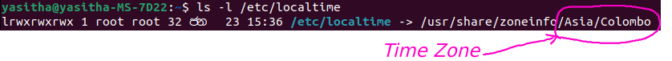

<p align="center">
  
</p>

# Check and Change Time

Time එක සහ date එක බැලීම සදහා 
```bash
date
```
> 2023 පෙබරවාරි  1 වැනි බදාදා 09:30:12 +0530

Check list of availble time zones

```bash
timedatectl list-timezones
```

Check time zone of my pc

```bash
ls -l /etc/localtime
```


Change Time zone
```bahs
sudo timedatectl set-timezone <your_time_zone>
```

**Ex :-** 
```bash
sudo timedatectl set-timezone Asia/Colombo
```