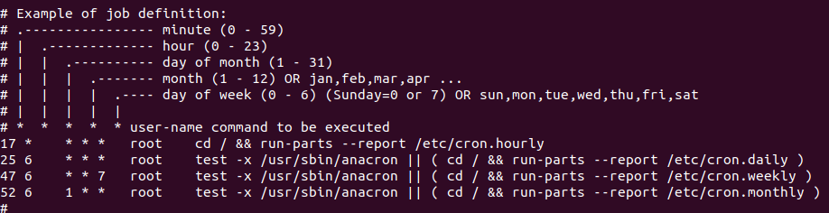

<p align="center">
  
</p>

# Cron Job (crontab)

Open cron tab file
```bash
cat /etc/crontab
```

Get list of Cron Jobs
```bash
crontab -l
```

# How to make cron job

## for current user

මෙම command එක පළමුවර යොදන විට cron job edit කිරීම කල යුත්තේ කුමන text editor එකේදීද යන්නන අසයි. එයට nano text editor එකට අදාල අංකය ලබා දීම බොහෝ සුදුසු වේ. මක්නිසාද nano text editor එක ඉතා පහසු වන බැවිනි.  

```bash
crontab -e
```



current user ට අදාලව අවුරුද්දේ සෑම දිනකම හවස 6:20 ට `test.txt` නමින් `this is my content` නමින් අන්තර්ගතයක් සහිත file එකක් සෑදීම. 

```bash
20 18 * * * /usr/bin/echo "this is my content" > /home/yasitha/test.txt
```

## for other user

වෙනත් user කෙනෙක් සදහා cron job එකක් assign කිරීම.

මෙයද මුල් වතා වේ භාවිතා කරන විට text editor එක කුමක් භාවිතා කල යුතුදැයි අසයි. එයට nano text editor එක ලබා දීම වඩා පහසු වේ. 
```bash
sudo crontab -u <user> -e
```

# Debug cronjob
in ubuntu
```bash
cat /var/log/syslog | grep -i "cron"
```


