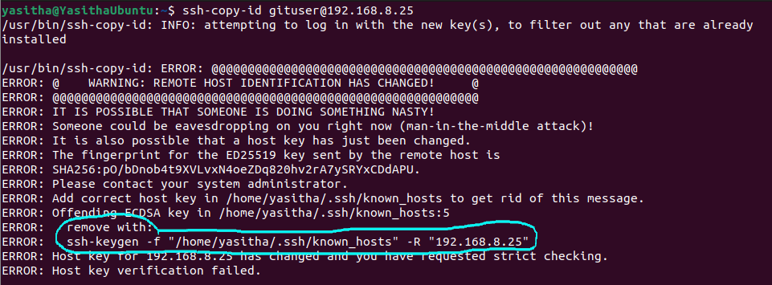

<p align="center">
  
  
</p>

<p align="center">
  <h1> Gitea for Ubuntu Server 20.04 </h1>
  
</p>

# Table of Contents
- [Table of Contents](#table-of-contents)
- [How to install](#how-to-install)
  - [Prepare Server](#prepare-server)
  - [Create SSH Connection](#create-ssh-connection)
  - [Generate SSH Public and Private key pair](#generate-ssh-public-and-private-key-pair)
  - [Login from Client to Server](#login-from-client-to-server)
  - [Install Gitea](#install-gitea)
  - [Client PC එකට DNS Entry එකක් add කිරීම](#client-pc-එකට-dns-entry-එකක්-add-කිරීම)
- [How to Backup](#how-to-backup)
- [How to Restore](#how-to-restore)
- [Private Repo URL](#private-repo-url)
- [Gitea NPM Package Registry](#gitea-npm-package-registry)
  - [Add package to Gitea NPM Package Registry](#add-package-to-gitea-npm-package-registry)
    - [Commands භාවිතයෙන්](#commands-භාවිතයෙන්)
    - [Config file භාවිතයෙන්](#config-file-භාවිතයෙන්)
  - [Upadte Package Version](#upadte-package-version)
  - [Publish Package](#publish-package)
  - [Download Pacakge](#download-pacakge)
- [Gitea PyPI Package Registry](#gitea-pypi-package-registry)
  - [Add package to Gitea PyPI Package Registry](#add-package-to-gitea-pypi-package-registry)
  - [Build Package](#build-package)
  - [Publish Package](#publish-package-1)
  - [Download Pacakge](#download-pacakge-1)


# How to install

## Prepare Server

පළමුව `gitea.zip` file එක extract කරගන්න.

එහි වූ `os folder` එකට ගොස් `ubuntu-20.04.5-live-server-amd64.iso` file එක ගෙන එය server එකට install කරගන්න. Install කිරීමේදී පහත තොරතුරු ලබාදෙන්න.

**server name :** `gitlocal`\
**username :** `gituser`

OS එක install වීමෙන් පසුව username එක හා password එක දී server එකට ලොග් වෙන්න.

## Create SSH Connection

දැන් server එක update කරන්න.

```bash
sudo apt update
```

server එකට `git` install කරගන්න.

```bash
sudo apt install git
```

ubuntu_server repo එක clone කරගන්න

```bash
git clone https://github.com/appzicpvt/ubuntu_server.git
```

> server එක පවතින්නේ `virtualbox` වල නම් network එක `NAT` වලින් `Bridge` වලට මාරු කරන්න.

දැන් පහත directory එකට යන්න.

```bash
cd ubuntu_server/20.04/set_static_ip/
```

set_ip.sh file එකට execute permission ලබා දෙන්න.

```bash
sudo chmod u+x set_ip.sh
```

දැන් set_ip.sh file එක run කරන්න.

```bash
sudo ./set_ip.sh
```

Host එකට `253` දෙන්න

නිවැරදිව IP address එක සකස් වී ඇති දැයි පරික්ෂා කිරීමට google DNS එක ping කරන්න.

```bash
ping 8.8.8.8
```

දැන් clone කරගත් github repo එක remove කරන්න.

```bash
cd ../../../ && rm -fr ubuntu_server
```

## Generate SSH Public and Private key pair

https://github.com/appzicpvt/docs/blob/main/linux/setup_ssh.md

## Login from Client to Server

දැන් client PC එකේ සිට server public ssh key එක copy කිරීම සදහා පහත command එක භාවිතා කරන්න.

```bash
ssh-copy-id gituser@192.168.8.253
```

> **error එකක් පැමිණියහොත්**\
> public ssh key එක copy කිරීමට ගිය විට පහත ආකාරයට error එකක් පැමිණියහොත් නිල් පාටින් රවුම් කර ඇති command එක යොදන්න.
> 
>
> ```bash
> ssh-keygen -f "/home/yasitha/.ssh/known_hosts" -R "192.168.8.253"
> ```
>
> දැන් නැවත public key එක copy කරන්න.
>
> ```bash
> ssh-copy-id gituser@192.168.8.253
> ```
>
> .

දැන් ssh මගින් server එකට log වෙන්න.

```bash
ssh gituser@192.168.8.253
```

log වීම සාර්ථක නම් server එකෙන් logout වෙන්න.

```bash
logout
```

## Install Gitea

මුලදී extract කරගත් gitea folder එකේ පවතින `deploy folder` එක server එකට scp මගින් copy කරගන්න.

```bash
scp -r ./gitea/deploy gituser@192.168.8.253:/home/gituser/
```

දැන් නැවත server එකට ssh මගින් login වෙන්න.

```bash
ssh gituser@192.168.8.253
```

deploy folder එක තුලට යන්න.

```bash
cd deploy
```

installer.sh එකට execute permission ලබා දෙන්න.

```bash
sudo chmod u+x installer.sh
```

installer.sh run කරන්න.

```bash
sudo ./installer.sh
```

Install වීම සාර්ථක නම් http://gitea.local ට යන්න. http://gitea.local load වෙන්නේ නැතිනම් ඔබගේ pc එකට `gitea.local` DNS Entry එක add කල යුතුය. ඒ සදහා [Client PC එකට DNS Entry එකක් add කිරීම](#client-pc-එකට-dns-entry-එකක්-add-කිරීම) බලන්න.

දැන් server එකෙන් reboot කරන්නන.

```bash
sudo reboot
```

දැන් නැවත server එකට ssh මගින් login වෙන්න.

```bash
ssh gituser@192.168.8.253
```

Delete source folder

```bash
rm -fr deploy
```

ls මගින් folder එක delete වී ඇති දැයි තහවුරු කරගන්න

```bash
ls
```

දැන් server එකෙන් reboot කරන්න.

```bash
sudo reboot
```

## Client PC එකට DNS Entry එකක් add කිරීම

`/etc/hosts` file එක nano මගින් open කරගන්න.

```bash
sudo nano /etc/hosts
```

එම file එකට පහත entry එක යොදා `ctrl+o` මගින් save කර `ctrl+x` මගින් ඉවත්වන්න.

> 192.168.8.253 gitea.local

<br>

# How to Backup
backup file එක Google Drive එකට upload වේ.
```
/usr/local/bin/dobackup.sh
```

# How to Restore
```bash
/usr/local/bin/dorestore.sh <backup_file>
```

# Private Repo URL
`git remote set origin` සදහා මෙය භාවිතා කල හැක.
```bash
http://<username>:<taken>@gitea.local/<username>/<project_name>.git
```

# Gitea NPM Package Registry

<p align="center">
  
</p>

## Add package to Gitea NPM Package Registry

### Commands භාවිතයෙන්

Project එක තුලට ගොස් පහත command දෙක යොදන්න.

1. `username` එක හා `personal_access_token` එක replace කර පහත command එක project එකේ root එක තුලදී භාවිතා කරන්න.

```bash
npm config set -- '//gitea.local/api/packages/<username>/npm/:_authToken' "<personal_access_token>"
```

2. `username` එක replace කර පහත command එක project එකේ root එක තුලදී භාවිතා කරන්න.

```bash
npm config set registry http://gitea.local/api/packages/<username>/npm/
```

### Config file භාවිතයෙන්

1. `home` directory එක තුල `.npmrc` file එකක් සාදා එයට `//gitea.local/api/packages/<username>/npm/:_authToken=<personal_access_token>` යන line එක යොදන්න. එය යෙදීමේදී `username` එක හා `personal_access_token` එක replace කිරීමට වගබලා ගන්න. නැතහොත් පහත command එක භාවිතා කරන්න.

```bash
echo "//gitea.local/api/packages/<username>/npm/:_authToken=<personal_access_token>" >> ~/.npmrc
```

2. Project root එක තුල `.npmrc` file එකක් සාදා එයට `registry=http://gitea.local/api/packages/<username>/npm/` යන line එක යොදන්න. එය යෙදීමේදී `username` එක replace කිරීමට වගබලා ගන්න. නැතහොත් project එකේ root එකේදී පහත command එක භාවිතා කරන්න.

```bash
echo registry=http://gitea.local/api/packages/<username>/npm/ >> ./.npmrc
```

## Upadte Package Version

Package එකේ version එක update කිරීමට ( **version_type** = `major` | `minor` | `patch` )

```bash
npm version <version_type>
```

## Publish Package

```bash
npm publish
```

## Download Pacakge

Project root එක තුල `.npmrc` file එකක් සාදා එයට `registry=http://gitea.local/api/packages/<username>/npm/` යන line එක යොදන්න. එය යෙදීමේදී `username` එක replace කිරීමට වගබලා ගන්න. නැතහොත් project එකේ root එකේදී පහත command එක භාවිතා කරන්න.

```bash
echo registry=http://gitea.local/api/packages/<username>/npm/ >> ./.npmrc
```

දැන් සාමාන්‍ය පරිදි npm install මගින් package එක install කරගන්න.

```bash
npm install <package_name>@<version>
```

# Gitea PyPI Package Registry

<p align="center">
  
</p>

## Add package to Gitea PyPI Package Registry

home dir එකට ගොස් එහි `.pypirc` නමින් file එකක් සාදා එයට පහත code එක යොදන්න. `<username>` හා `<personal_access_token>` එක replace කිරීමට වගබලා ගන්න.
```cfg
[distutils]
index-servers =
        gitea

[gitea]
repository = http://git.local/api/packages/appzic/pypi
username = <username>
password = <personal_access_token>
```

මීට අමතරව තවත් pypi registry එකක් add කිරීමට අවශ්‍යයි නම් එය පහත ආකාරයට ඇතුලත් කල හැක.
```cfg
[distutils]
index-servers =
        gitea
        testpypi

[gitea]
repository = http://git.local/api/packages/appzic/pypi
username = <username>
password = <personal_access_token>

[testpypi]
repository = https://test.pypi.org/legacy/
username = __token__
password = <testpypi_access_token>
```

PyPI package එකක් publish කිරීමට `setuptools` හා `twine`
```bash
pipenv install setuptools twine
```

## Build Package

```bash
python setup.py sdist bdist_wheel
```

## Publish Package
```bash
twine upload --repository gitea dist/*
```

## Download Pacakge
```bash
pipenv install -i http://gitea.local/api/packages/<username>/pypi/simple <package_name>=<version>
```
