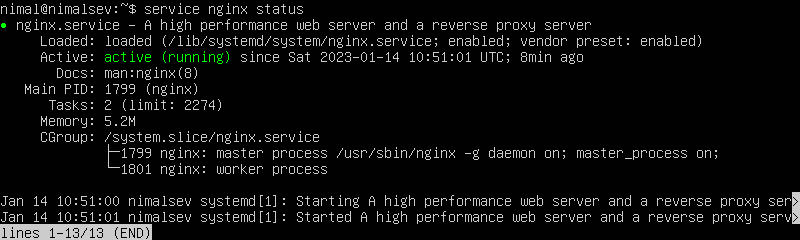

<p align="center">
  
</p>

## How to Install Nginx

Update system
```bash
sudo apt update
```

Install Nginx
```bash
sudo apt install nginx
```

## Nginx Service

Nginx service එක start කර ඇතිදැයි බැලීම
```bash
service nginx status
```

service එක start වී ඇති නම් පහත පරිදි message එකක් පෙනෙනු ඇත.



Nginx service එක start කිරීම
```bash
sudo service nginx start
```

Nginx service එක restart කිරීම
```bash
sudo service nginx restart
```

Nginx service එක stop කිරීම
```bash
sudo service nginx stop
```

## Host single website

client pc එකේ web browser එකක server එකේ IP address එක type කල විට nginx home page එක පහත පරිදි දර්ශණය වේ.

නැතහොත් server pc එකේදී `http://localhost/` මගින් ද nginx home page එක වෙත log විය හැක.


Nginx home page එක host කර ඇත්තේ `/var/www/html` එක තුලයි. ඔබට අවශ්‍ය website එක එය තුලට deploy කරගත හැක.


## Reverse Proxy

`/etc/nginx/conf.d/` folder එක තුලට යන්න. එයතුල `<example_com>.conf` නමින් file එකක් සාදන්න.

එම file එක පහත ආකාරයට සකස් කරන්න.

```conf
server {
    listen 80;
    server_name <example.com>;

    location / {
        proxy_set_header   X-Forwarded-For $remote_addr;
        proxy_set_header   Host $http_host;
        proxy_pass         "<http://127.0.0.1:8080>";
    }
}
```

මෙහි පහත සදහන් data update කල යුතුය.

`<example.com>` client pc එකේදී භාවිතා වන ip address එක හෝ domain එක  \
`<http://127.0.0.1:8080>` loopback ip එක අදාල port එක සමග

උදාහරණයක් ලෙස
```conf
server {
    listen       3000;
    server_name  vecpad_frontend;

    location / {
        proxy_set_header   X-Forwarded-For $remote_addr;
        proxy_set_header   Host $http_host;
        proxy_pass         http://127.0.0.1:3000;
    }
}
```

දැන් Nginx restart කරන්න.
```bash
sudo service nginx restart
```

## Host Multiple Websites

`abc.local` හා `xyz.local` යන domain දෙකට අදාලව website දෙකක් Host කිරීමට අවශ්‍ය යැයි සිතමු. 

- `/var/www/` folder එක තුලට යන්න. එය තුල `abc.local` හා `xyz.local` යන නමින් folders දෙකක සාදන්න.
- දැන් ඒ folder දෙක තුලට host කිරීමට අවශ්‍ය websites දෙක දමන්න.
- දැන් `/etc/nginx/conf.d/` folder එක තුලට යන්න. ඒ තුල `abc.local.conf` හා `xyz.local.conf` නමින් file දෙකක් සාදන්න.

පහත configuration සිදුකර ඇත්තේ **http** සදහාය. 

**abc.local.conf** 
```conf
server {
    listen 80;
    server_name abc.local;

    location / {
      root /var/www/abc.local/;
      index index.html;
    }
}
```

**xyz.local.conf**
```conf
server {
    listen 80;
    server_name xyz.local;

    location / {
      root /var/www/xyz.local/;
      index index.html;
    }
}
```

දැන් nginx service එක restart කරන්න
```bash
sudo service nginx restart
```

website දෙකට අදාලව [client PC එකේ DNS entry දෙකක් add කිරීමට](setup_gitea.md/#client-pc-එකට-dns-entry-එකක්-add-කිරීම) වගබලාගන්න. 
