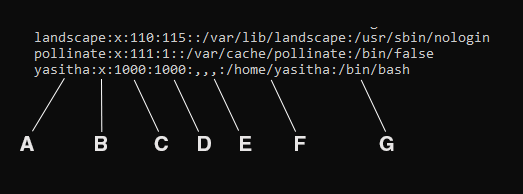

# User and Group Management

## අලුතින් user accout එකක් සෑදීම.
```bash
sudo adduser <username>
```

## දැනට ඇති user account මොනවාදැයි බැලීම.
```bash
cat /etc/passwd
```



මෙහි එක් එක් line එකෙන් මෙහි ඇති user account මොනවාදැයි දැක්වේ. user account එකේ විස්තර දැක්වෙන fields `:` මගින් වෙන්කොට දක්වා ඇත. එහි විස්තර පහත පරිදි වේ.

|#| Field | Description |
|-|-|-|
|`A`|`Username`|The name used to log in to the account|
|`B`|`Password`|Usually stored as 'x' because actual passwords are stored in the /etc/shadow file for security reasons.|
|`C`|`User ID (UID)`|A unique numerical identifier for the user.|
|`D`|`Group ID (GID)`|The primary group ID of the user.|
|`E`|`User Info`|Additional information about the user (such as full name, contact details, etc.).|
|`F`|`Home directory`|The absolute path to the user's home directory.|
|`G`|`Shell`|The default shell or command interpreter for the user.|

සාමාන්‍යයෙන් `User ID` එක 1000 ට වඩා අඩු නම් එයින් system account එකකුත්, 1000 වඩා වැඩිනම් එයින් සාමාන්‍ය user account එකකුත් දැක්වේ.

දැනට ඇති user account ගණන සෙවීම
```bash
cat /etc/passwd | wc -l
```

## User account එකක් delete කිරීම.
මෙහිදී user account එකට අදාල home directory එක delete වීමක් සිදුනොවේ.
```bash
sudo deluser <username>
```

මෙහිදී user account එකට අදාල home directory එක delete වීම සිදුවේ.
```bash
sudo deluser --remove-home <username>
```

## Password එක වෙනස් කිරීම
දැනට log වී ඇති user account එකේ password එක වෙනස් කිරීම.
```bash
passwd
```

වෙනත් account එකක password එක වෙනස් කිරීම
```bash
sudo passwd <usename>
```

## User account එක ඇතුලත් වන Groups මොනවාදැයි බැලීම
දැනට log වී ඇති user account එක අයත් වන groups මොනවාදැයි බැලීම.
```bash
groups
```


ලැබෙන result එකේ පළමු group එක එම user ගේ primary group එක වශයෙනුත් අනෙක් ඒවා එම user ඇතුලත් secondary groups වශයෙනුත් හදුන්වයි.  

වෙනත් account එකක් අයත් වන groups මොනවාදැයි බැලීම.
```bash
groups <username>
```

## දැනට ඇති groups මොනවාදැයි බැලීමට
```bash
cat /etc/group
```


මෙහි එක් එක් line එකෙන් මෙහි ඇති groups මොනවාදැයි දැක්වේ. group එකේ විස්තර දැක්වෙන fields `:` මගින් වෙන්කොට දක්වා ඇත. එහි විස්තර පහත පරිදි වේ.

|#| Field | Description |
|-|-|-|
|`A`|`Group Name`|The name of the group|
|`B`|`Password`|Typically stored as 'x', indicating the password is stored in the /etc/gshadow file.|
|`C`|`Group ID (GID)`|A unique numerical identifier for the group.|
|`D`|`User List`|A list of users who are members of this group. If empty, no users are members of the group.|

## අලුතින් group එකක් සෑදීම
```bash
sudo addgroup <group_name>
```

## දැනට පවතින group එකක් delete කිරීම
```bash
sudo delgroup <group_name>
```

## user කෙනෙක් group එකකට ඇතුලත් කිරීම
```bash
sudo gpasswd --add <username> <group_name> 
```

## user කෙනෙක් group එකකින් ඉවත් කිරීම
```bash
sudo gpasswd --delete <username> <group_name> 
```