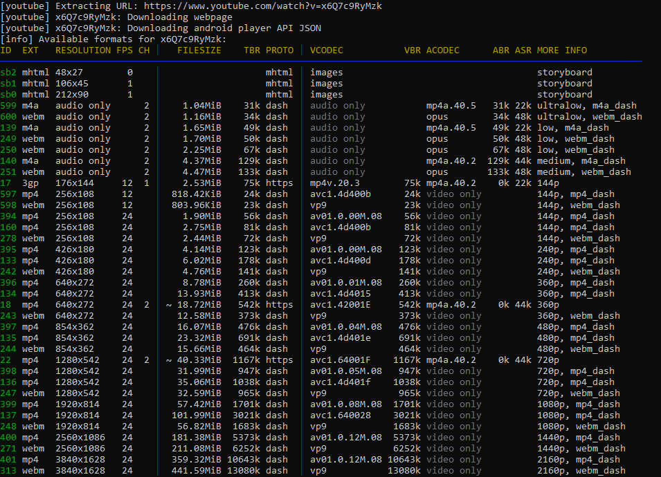
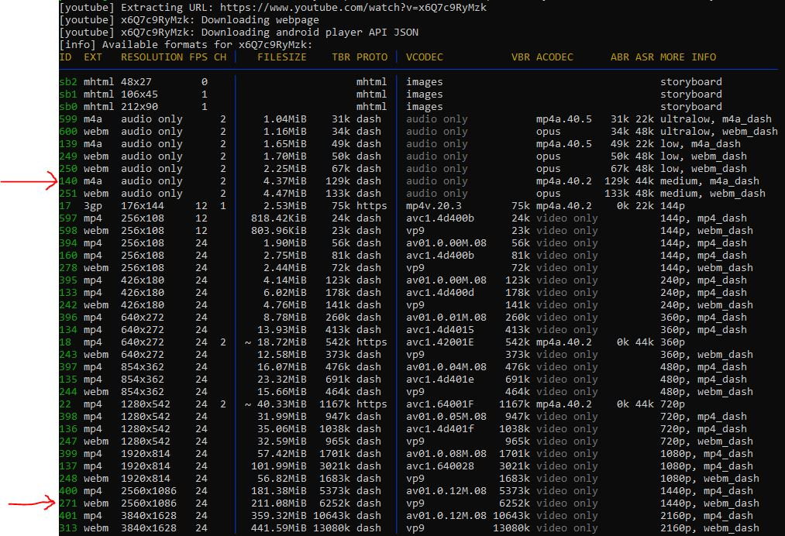

# yt-dlp

Check Video Qulity
```bash
yt-dlp -F --list-formats <video_URL>
```



## Download selected format

Audio හා Video Format එකතු කිරීමට `ffmpeg` තිබිය යුතුය.
```bash
sudo apt install -y ffmpeg
```

### හොදම පැත්තේ සිට select කිරීම
උදාහරණයක් ලෙස `3 වන ස්ථානයට හොදම video` එකත් `2 වන ස්ථානයට හොදම audio` එකත් download කිරීමට.
```bash
yt-dlp -f "bv.3+ba.2" <video_URL>
```



### නරකම පැත්තේ සිට select කිරීම

උදාහරණයක් ලෙස `5 වන ස්ථානයට නරකම video` එකත් `3 වන ස්ථානයට හොදම audio` එකත් download කිරීමට.

```bash
yt-dlp -f "wv.5+ba.3" <video_URL>
```

