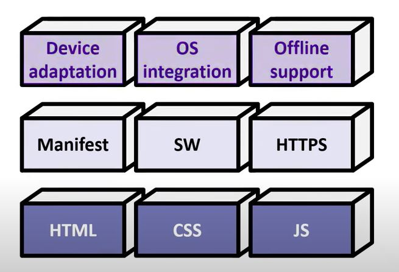
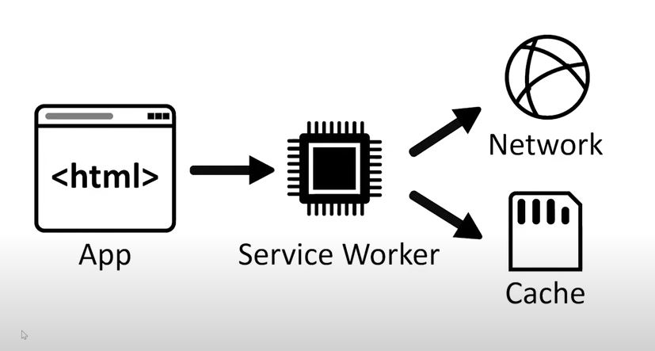

# Progressive Web Apps

## Three layers of PWA



## Service Worker

Service worker එකක ප්‍රධානතම කාර්යය වන්නේ app එක, network එකත් සමග ගනුදෙනු කිරීමේදී `proxy layer එකක්` ලෙස ක්‍රියා කිරීමයි.  App එක request එකක් යවන අවස්ථාවේදී අතරමැදියකු ලෙස serviec worker එක ක්‍රියාකරයි. මේ නිසා App එක offline පවතින විට cache storage එකෙන්ද, online ව පවතින විට network එක මගින්ද data ලබාගැනීම service worker එකේ කාර්යයක් වේ. මේ නිසා app එක, network එක සහ cache storage එක එකිනෙක සම්බන්ධ කිරීම service worker එක මගින් සිදුවේ.



Service worker යනු Javascript file එකකි.

Service worker එකකට background එකෙන් run වීමේ හැකියාව ඇත. (push notification සදහා)

Service worker එකක් develop කිරීම සදහා [Workbox](https://developer.chrome.com/docs/workbox/) library එක භාවිතා කල හැක.

### Resigter
Service worker file එකේ නම `sw.js` නම්. එය පහත ආකාරයෙන් HTML file එක මාර්ගයෙන් import කරගත යුතුය.

```html
<script>
        if ('serviceWorker' in navigator) {
            window.addEventListener('load', () => {
                navigator.serviceWorker.register('/sw.js') // < --- import sevice worker
                    .then(registration => {
                        console.log('Service Worker registered with scope:', registration.scope);
                    })
                    .catch(error => {
                        console.error('Service Worker registration failed:', error);
                    });
            });
        } else {
            console.log('Service Worker is not supported in this browser.');
        }
    </script>
```

### Listening for Events

#### Install

#### Active

#### Fetch

### Cacheing