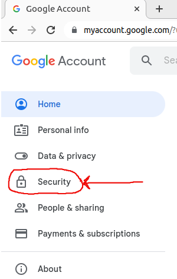
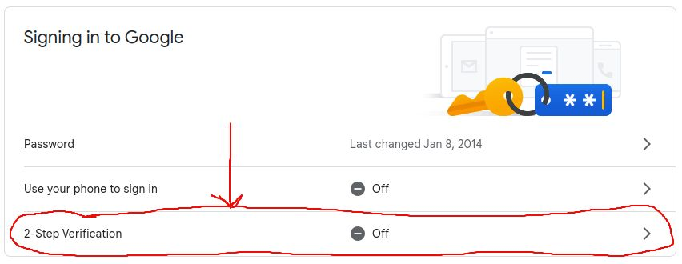
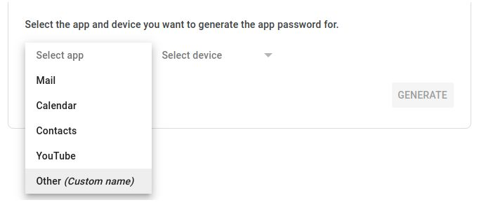

<p align="center">
  
</p>

# Genarate Google SMTP Password
- Click 9 dot icon
- Goto `Account` page


- Goto `Security` section



- Goto `2 Step Verification` and setup it



- After goto `App password`


- Generate passord for `Other (Custom name)`



# Setup SMTP on Ubuntu 22.04

Update system
```bash
sudo apt update
```

Install `sSMTP`
```bash
sudo apt install ssmtp
```

Open `ssmtp.conf` using nano editor
```bash
sudo nano /etc/ssmtp/ssmtp.conf
```

Edit `ssmtp.conf` as following for **Google SMTP**
```conf
#
# Config file for sSMTP sendmail
#
# The person who gets all mail for userids < 1000
# Make this empty to disable rewriting.
root=example@gmail.com

# The place where the mail goes. The actual machine name is required no 
# MX records are consulted. Commonly mailhosts are named mail.domain.com
mailhub=smtp.gmail.com:587

# Where will the mail seem to come from?
#rewriteDomain=

AuthUser=example@gmail.com
AuthPass=****************
UseSTARTTLS=YES
UseTLS=YES

# The full hostname
hostname=localhost

# Are users allowed to set their own From: address?
# YES - Allow the user to specify their own From: address
# NO - Use the system generated From: address
FromLineOverride=YES

```